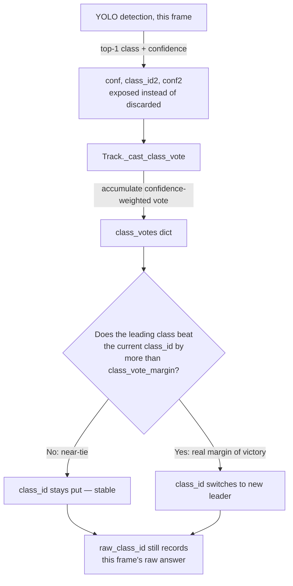

# Classification Stabilization 

### For Rresults refer to: 

https://anubis-sipg.isr.tecnico.ulisboa.pt/index.php/apps/files/files/3091297?dir=/pav_central

## 1. Starting problem

Bounding boxes had a class label but no visibility into how confident that label was, or what the model's second guess was. Separately, the same physical object would sometimes show a different class over time — "classes flip for the same object."

## 2. How the classes actually flip — investigation trail

Three hypotheses were tested, in order, using the data the tracker itself produces:

1. **Second-guess visibility was missing entirely.** `boxes.conf` (top-1 confidence) was computed by YOLO every frame and silently discarded; the second-most-likely class wasn't computed at all. Fixed first since it's a prerequisite for everything after.
2. **Track ID churn** — the same object getting a new track ID after a brief tracking failure, with the new track's class decided by a single fresh (possibly wrong) frame. Built `diagnose_id_churn.py` to measure this directly from CSV output rather than guess. Result: after filtering out false positives (two *different*, differently-classed objects happening to share the same screen location — a parked spot, a stop zone), genuine churn was only **~1.5%** of tracks. Not the main cause.
3. **Within-track class instability** — the real cause. Querying the CSV directly: **68 of 197 tracks** had their `class_id` change at least once during their own lifetime (same continuous track, no ID change), and **11 tracks flipped 3+ times**. The switches happened at a median position jump of **0.01 box-widths** (i.e. the exact same box, one frame later) with low, near-tied confidence on both sides — e.g. `person@0.73 → car@0.69`. This is a single physical object whose per-frame classification is genuinely ambiguous for sustained stretches, and the class-selection logic had no hysteresis: any lead at all, however small, flipped the displayed label.



## 3. Changes to `tracker.py`

### 3.1 Per-detection classification confidence (new)

| Field | Meaning |
|---|---|
| `conf` | This frame's top-1 classification confidence (was computed by YOLO, previously thrown away) |
| `class_id2` / `conf2` | Second most likely class this frame, restricted to the 5 tracked classes (person/car/moto/bus/truck) — not all 80 COCO classes, since only the tracked ones are actionable. Recovered by re-running the model's raw forward pass and matching each final NMS'd box back to its source anchor, since YOLO's detection head scores every class independently (sigmoid) before collapsing to just the top pick. **Unavailable in SAHI mode** (tile-merge only keeps the winning class) — prints a one-time note and reports `-1` / `NaN`. |

### 3.2 Class stabilization — confidence-weighted majority vote (new)

Previously `class_id` was set once at track creation and never touched again. Now:

- Every frame a track matches a detection, that frame's top-1 class casts a vote weighted by its confidence into `Track.class_votes`.
- `class_id` is the class with the most accumulated weight — recomputed each update, not frozen at spawn. This alone fixes a track anchored forever to one bad first-frame guess.
- **`class_vote_margin`** (default `0.20`, new `TrackerConfig` field): the leading class must beat the current one by this relative margin before `class_id` actually switches. Plain "any lead wins" was tested and found to genuinely flip-flop on real data (see §2.3) — a 500-trial simulation of a near-tied 55/45 classifier showed this drops average switches/track from **7.57 → 1.51** and tracks with 3+ switches from **67.8% → 22.6%**, with only a small (~4pp) cost to eventual correction accuracy.
- **`raw_class_id`** (new field): this frame's *unvoted* top-1 class, exported alongside the stabilized `class_id` so you can always see when the vote is overriding a given frame rather than guessing.
- **`class_vote_share`** (new field, 0–1): how dominant `class_id` is among that track's accumulated votes. Near 1.0 = settled; near 0.5 = still genuinely contested — a direct way to flag shaky tracks instead of inferring it from flip counts.

### 3.3 Device selection fix (performance, not classification, but changed this session)

`_select_device()` now checks CUDA → Apple Silicon MPS → CPU, instead of only CUDA → CPU. Every Mac was silently running both YOLO and the Re-ID ResNet50 on CPU regardless of hardware.

## 4. New CLI flags (`run_tracker_silent.py`)

| Flag | Default | Purpose |
|---|---|---|
| `--appearance-weight` | 0.80 | Re-ID (visual similarity) vs. position weight in track matching |
| `--max-cost` | 0.92 | Matching cost reject threshold — lower = stricter (more fragmentation, fewer wrong-object matches) |
| `--class-vote-margin` | 0.20 | Margin required before `class_id` switches (see §3.2) |

## 5. New CSV / output columns

| Column | Meaning |
|---|---|
| `class_id`, `class_name` | Stabilized, majority-vote class |
| `raw_class_id`, `raw_class_name` | This frame's unvoted top-1 class |
| `class_vote_share` | How settled `class_id` is, 0–1 |
| `conf` | This frame's top-1 confidence (for `raw_class_id`, not necessarily `class_id`) |
| `class_id2`, `class_name2`, `conf2` | Second-most-likely class this frame (unavailable in SAHI mode) |

## 6. Diagnostic tool: `diagnose_id_churn.py` (new file)

Standalone script, run against any tracker CSV output, no re-run of the tracker needed:

```
python diagnose_id_churn.py output.csv                          # default 90-frame window
python diagnose_id_churn.py output.csv --max-gap-frames 300      # check for missed longer gaps
python diagnose_id_churn.py output.csv --require-same-class      # filter location-reuse false positives
```

Projects each ending track's position forward using its own estimated velocity (not a static last-known position — this tracker targets large interframe displacement, so a static assumption undercounts churn, sometimes to zero) and looks for a track starting nearby, soon after. Outputs a `*_candidate_splits.csv` for manual review; this is a heuristic, not ground truth.

## 7. Suggested next check

Re-run with the updated `tracker.py` and look at the new `class_vote_share` and `raw_class_id` columns directly:

```python
import pandas as pd
df = pd.read_csv("output.csv")

# How many tracks still show real instability?
flips = df.groupby("track_id")["class_id"].nunique()
print((flips > 1).sum(), "/", df.track_id.nunique(), "tracks still have >1 class_id")

# Which tracks are still contested (vote never settles)?
low_share = df.groupby("track_id")["class_vote_share"].min()
print(low_share.sort_values().head(10))
```

Compare against the pre-fix numbers from this session (68/197 tracks flipped, 11 with 3+ switches) to confirm the improvement.
